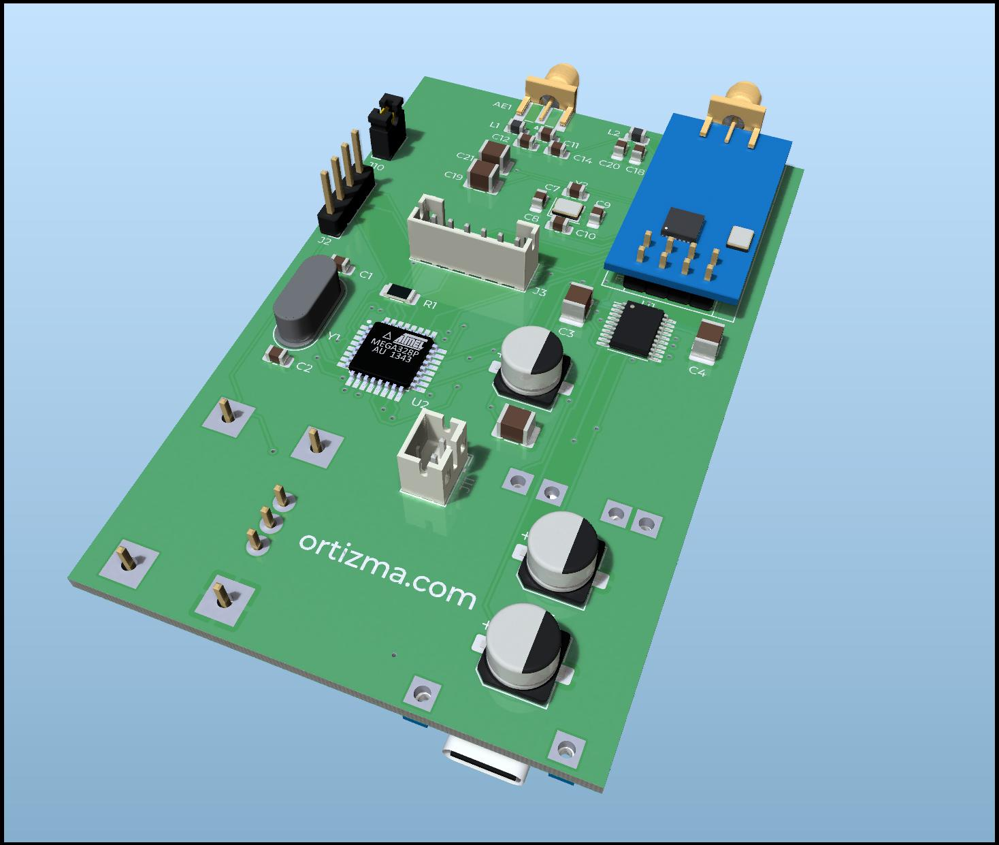

# Multi-Door Garage Remote

Welcome to the Multi-Door Garage Remote repository! This project aims to provide a versatile solution for remotely controlling multiple garage doors that operate on the 433MHz fixed code protocol. While the current implementation is based on the fixed code protocol, it has the potential to be extended to support rolling code protocols and other RF parameters. Additionally, it has the necessary hardware to open garage doors operating at 280MHz, although this feature is yet to be implemented and tested.

## Features

1. **Multi-Door Support**: Control multiple garage doors using a single remote device.
2. **433MHz Protocol**: Designed to work with garage doors utilizing the 433MHz fixed code protocol.
3. **Potential for Expansion**: The architecture is built to potentially accommodate rolling code protocols and other RF parameters in the future.
4. **Experimental 280MHz Support**: The device has the capability to open doors operating at 280MHz, although testing is pending.
5. **Low Power Consumption**: The board features a battery charging module and uses a Li-Po battery. It has been optimized to consume only 2 µA during inactivity.

## Contents

This repository contains:

1. **Electronics Design**: Detailed electronic schematics and PCB layouts to help you build the remote device.
2. **Firmware**: The firmware code that runs on the microcontroller, allowing it to communicate with garage doors.
3. **3D Printed Case Design** (Pending): The design files for the 3D printed case that will house the remote device.
4. **Documentation**: Additional information and usage instructions can be found on the [ortizma.com](https://ortizma.com) blog.

## Getting Started

To get started with this project, follow these steps:

1. **Electronics Assembly**: Review the electronics design and assemble the required components according to the schematics provided.
2. **Generate and Replace Codes**: Before flashing the firmware, generate the appropriate codes for your garage doors using the provided Node-JS script, and replace the provided ones. The firmware currently has codes for 3 garages with 2 doors each, which have been slightly altered for security reasons.
3. **Firmware Installation**: Use ICSP to flash the firmware into the Atmega328P microcontroller.
4. **Testing and Configuration**: Test the remote with your garage doors. Use SDR to troubleshoot any mismatches between the generated signal and the one generated by your remote.
5. **280MHz Testing** (Optional): If you have garage doors operating at 280MHz, you can test the remote's capability to operate them. The firmware still doesn't support this so you would have to implement the driver for the MAX7060 chip.
6. **3D Printed Case** (Pending): Once available, 3D print the case and assemble the remote device within it.

## Contributions

Contributions to this project are welcome! If you have ideas for improvements, bug fixes, or extensions to support different protocols, feel free to open an issue or submit a pull request.

## Disclaimer

Please note that this project involves working with RF protocols and electronics. Incorrect handling or usage can lead to unintended consequences or safety hazards. Be sure to understand what you're doing and follow best practices when assembling and using the remote device.

## Contact

For more information, updates, and detailed documentation, visit [ortizma.com](https://ortizma.com). Feel free to reach out to the project maintainer via email at pabloortiz132@gmail.com.

I hope you find this project useful and inspiring! Happy tinkering!